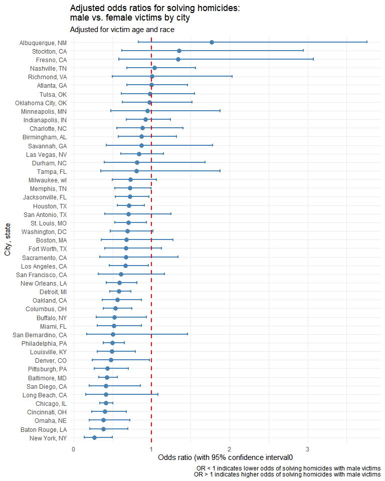
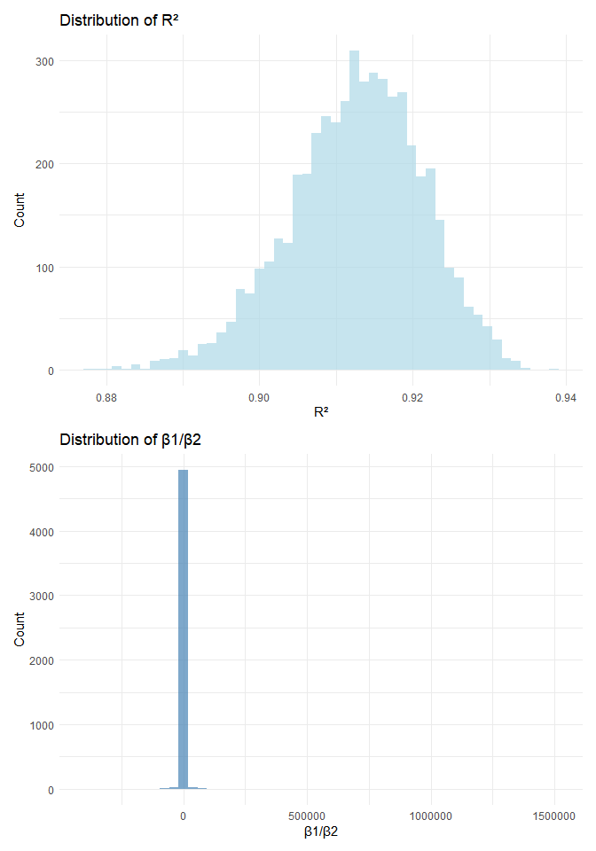
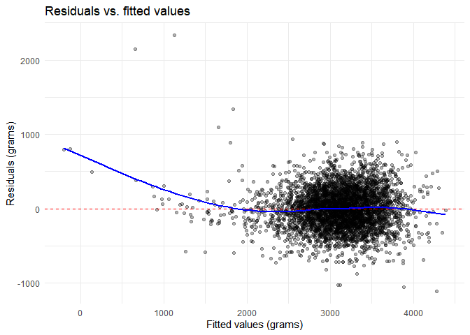

P8105 HOMEWORK 6
================
Anu Singh
2025-12-03

Loading necessary libraries for assignment:

``` r
library(tidyverse)
library(p8105.datasets)
library(modelr)
library(patchwork)
```

## PROBLEM 1

### Data preparation

``` r
# Loading the homicide data
homicides_clean = read_csv("./data/homicide-data.csv") %>%
  
  # Creating city_state variable
  mutate(city_state = str_c(city, ", ", state),
         
  # Creating binary resolved variable (1 = resolved, 0 = unresolved)
         resolved = case_when(disposition == "Closed by arrest" ~ 1,
                            TRUE ~ 0)) %>% 
  
  # Cities to omit
  filter(!city_state %in% c("Dallas, TX", "Phoenix, AZ", "Kansas City, MO", "Tulsa, AL")) %>%  
  
  # Limiting victim_race to white or black
  filter(victim_race %in% c("White", "Black")) %>%
  
  # Converting victim_age to numeric 
  mutate(victim_age = as.numeric(victim_age)) %>%
  
  # Removing rows with missing victim_age (GLM function can already filter out NA values, but implementing here explicitly)
  filter(!is.na(victim_age))

# Checking the cleaned data
head(homicides_clean)
```

    ## # A tibble: 6 × 14
    ##   uid   reported_date victim_last victim_first victim_race victim_age victim_sex
    ##   <chr>         <dbl> <chr>       <chr>        <chr>            <dbl> <chr>     
    ## 1 Alb-…      20100601 SATTERFIELD VIVIANA      White               15 Female    
    ## 2 Alb-…      20100102 MULA        VIVIAN       White               72 Female    
    ## 3 Alb-…      20100126 BOOK        GERALDINE    White               91 Female    
    ## 4 Alb-…      20100130 MARTIN-LEY… GUSTAVO      White               56 Male      
    ## 5 Alb-…      20100308 GRAY        STEFANIA     White               43 Female    
    ## 6 Alb-…      20100323 DAVID       LARRY        White               52 Male      
    ## # ℹ 7 more variables: city <chr>, state <chr>, lat <dbl>, lon <dbl>,
    ## #   disposition <chr>, city_state <chr>, resolved <dbl>

### Baltimore, MD analysis

``` r
# Filtering for Baltimore
baltimore_data = homicides_clean %>%
  filter(city_state == "Baltimore, MD")

# Fitting logistic regression (family = binomial)
baltimore_model = glm(resolved ~ victim_age + victim_sex + victim_race, 
                       data = baltimore_data, 
                       family = binomial())

# Displaying model summary
summary(baltimore_model)
```

    ## 
    ## Call:
    ## glm(formula = resolved ~ victim_age + victim_sex + victim_race, 
    ##     family = binomial(), data = baltimore_data)
    ## 
    ## Coefficients:
    ##                   Estimate Std. Error z value Pr(>|z|)    
    ## (Intercept)       0.309981   0.171295   1.810   0.0704 .  
    ## victim_age       -0.006727   0.003324  -2.024   0.0430 *  
    ## victim_sexMale   -0.854463   0.138176  -6.184 6.26e-10 ***
    ## victim_raceWhite  0.841756   0.174716   4.818 1.45e-06 ***
    ## ---
    ## Signif. codes:  0 '***' 0.001 '**' 0.01 '*' 0.05 '.' 0.1 ' ' 1
    ## 
    ## (Dispersion parameter for binomial family taken to be 1)
    ## 
    ##     Null deviance: 3567.9  on 2752  degrees of freedom
    ## Residual deviance: 3492.7  on 2749  degrees of freedom
    ## AIC: 3500.7
    ## 
    ## Number of Fisher Scoring iterations: 4

``` r
# Extracting odds ratio and confidence interval for victim_sex (males vs. females)
baltimore_results = baltimore_model %>%
  broom::tidy() %>%
  mutate(
    OR = exp(estimate),
    CI_lower = exp(estimate - 1.96 * std.error),
    CI_upper = exp(estimate + 1.96 * std.error)
  ) %>%
  filter(term == "victim_sexMale") %>%
  select(term, OR, CI_lower, CI_upper)

# Diplaying results
knitr::kable(baltimore_results)
```

| term           |        OR | CI_lower |  CI_upper |
|:---------------|----------:|---------:|----------:|
| victim_sexMale | 0.4255117 | 0.324559 | 0.5578655 |

**Interpretation (Baltimore):** The adjusted odds ratio for solving
homicides comparing male victims to female victims is 0.426 (95% CI:
0.325 - 0.558), keeping all other variables fixed. This suggests that
homicides with male victims have lower odds of being solved compared to
female victims in Baltimore.

### Analysis for all cities

``` r
# Function to fit logistic regression and extract OR for victim_sex
fit_city_model = function(df) {
  
  # Fitting the model
  model = glm(resolved ~ victim_age + victim_sex + victim_race, 
               data = df, 
               family = binomial())
  
  # Extracting and tidying results
  model %>%
    broom::tidy() %>%
    mutate(
      OR = exp(estimate),
      CI_lower = exp(estimate - 1.96 * std.error),
      CI_upper = exp(estimate + 1.96 * std.error)
    ) %>%
    filter(term == "victim_sexMale") %>%
    select(OR, CI_lower, CI_upper)
}

# Applying the function to each city using purrr::map
city_results = homicides_clean %>%
  # Nesting data by city
  nest(data = -city_state) %>%
  
  # Applying the model fitting function to each city
  mutate(model_results = map(data, fit_city_model)) %>%
  
  # Unnesting the results
  unnest(model_results) %>%
  
  # Selecting and arranging by OR (lowest to highest)
  select(city_state, OR, CI_lower, CI_upper) %>%
  arrange(OR)

# Displaying results
knitr::kable(city_results)
```

| city_state         |        OR |  CI_lower |  CI_upper |
|:-------------------|----------:|----------:|----------:|
| New York, NY       | 0.2623978 | 0.1379459 | 0.4991275 |
| Baton Rouge, LA    | 0.3814393 | 0.2092532 | 0.6953103 |
| Omaha, NE          | 0.3824861 | 0.2029670 | 0.7207853 |
| Cincinnati, OH     | 0.3998277 | 0.2360847 | 0.6771390 |
| Chicago, IL        | 0.4100982 | 0.3359897 | 0.5005527 |
| Long Beach, CA     | 0.4102163 | 0.1555148 | 1.0820672 |
| San Diego, CA      | 0.4130248 | 0.1995220 | 0.8549909 |
| Baltimore, MD      | 0.4255117 | 0.3245590 | 0.5578655 |
| Pittsburgh, PA     | 0.4307528 | 0.2650983 | 0.6999213 |
| Denver, CO         | 0.4790620 | 0.2364294 | 0.9706934 |
| Louisville, KY     | 0.4905546 | 0.3047208 | 0.7897189 |
| Philadelphia, PA   | 0.4962756 | 0.3776157 | 0.6522225 |
| San Bernardino, CA | 0.5003444 | 0.1712084 | 1.4622204 |
| Miami, FL          | 0.5152379 | 0.3044831 | 0.8718716 |
| Buffalo, NY        | 0.5205704 | 0.2897705 | 0.9352008 |
| Columbus, OH       | 0.5324845 | 0.3782581 | 0.7495933 |
| Oakland, CA        | 0.5630819 | 0.3650924 | 0.8684409 |
| Detroit, MI        | 0.5823472 | 0.4622017 | 0.7337235 |
| New Orleans, LA    | 0.5849373 | 0.4217648 | 0.8112381 |
| San Francisco, CA  | 0.6075362 | 0.3167902 | 1.1651253 |
| Los Angeles, CA    | 0.6618816 | 0.4581299 | 0.9562510 |
| Sacramento, CA     | 0.6688418 | 0.3347138 | 1.3365132 |
| Fort Worth, TX     | 0.6689803 | 0.3969391 | 1.1274643 |
| Boston, MA         | 0.6739912 | 0.3560002 | 1.2760222 |
| Washington, DC     | 0.6901713 | 0.4683853 | 1.0169757 |
| St. Louis, MO      | 0.7031665 | 0.5303670 | 0.9322661 |
| San Antonio, TX    | 0.7046200 | 0.3976578 | 1.2485342 |
| Houston, TX        | 0.7110264 | 0.5576715 | 0.9065526 |
| Jacksonville, FL   | 0.7198144 | 0.5365350 | 0.9657017 |
| Memphis, TN        | 0.7232194 | 0.5291729 | 0.9884224 |
| Milwaukee, wI      | 0.7271327 | 0.4987091 | 1.0601810 |
| Tampa, FL          | 0.8077029 | 0.3477529 | 1.8759988 |
| Durham, NC         | 0.8123514 | 0.3920374 | 1.6832957 |
| Las Vegas, NV      | 0.8373078 | 0.6076753 | 1.1537154 |
| Savannah, GA       | 0.8669817 | 0.4222665 | 1.7800544 |
| Birmingham, AL     | 0.8700153 | 0.5742951 | 1.3180098 |
| Charlotte, NC      | 0.8838976 | 0.5569929 | 1.4026659 |
| Indianapolis, IN   | 0.9187284 | 0.6794344 | 1.2423006 |
| Minneapolis, MN    | 0.9469587 | 0.4782860 | 1.8748838 |
| Oklahoma City, OK  | 0.9740747 | 0.6240860 | 1.5203378 |
| Tulsa, OK          | 0.9757694 | 0.6135882 | 1.5517343 |
| Atlanta, GA        | 1.0000771 | 0.6836012 | 1.4630669 |
| Richmond, VA       | 1.0060520 | 0.4979508 | 2.0326120 |
| Nashville, TN      | 1.0342379 | 0.6847143 | 1.5621816 |
| Fresno, CA         | 1.3351647 | 0.5804995 | 3.0709150 |
| Stockton, CA       | 1.3517273 | 0.6211368 | 2.9416496 |
| Albuquerque, NM    | 1.7674995 | 0.8306581 | 3.7609388 |

### Visualization

``` r
# Creating the plot
ggplot(city_results, aes(x = OR, y = reorder(city_state, OR))) +
  
  # Adding point for OR estimate
  geom_point(size = 3, color = "steelblue") +
  
  # Adding error bars for confidence intervals
  geom_errorbarh(aes(xmin = CI_lower, xmax = CI_upper), 
                 height = 0.3, color = "steelblue", linewidth = 0.8) +
  
  # Adding vertical line at OR = 1 (null hypothesis)
  geom_vline(xintercept = 1, linetype = "dashed", color = "red", linewidth = 0.8) +
  
  # Labels and theme
  labs(
    title = "Adjusted odds ratios for solving homicides:\nmale vs. female victims by city",
    subtitle = "Adjusted for victim age and race",
    x = "Odds ratio (with 95% confidence interval0",
    y = "City, state",
    caption = "OR < 1 indicates lower odds of solving homicides with male victims\nOR > 1 indicates higher odds of solving homicides with male victims"
  ) +
  
  theme_minimal()
```

<!-- -->

**Interpretation (plot):**

- The plot shows a significant pattern across nearly all cities:
  homicides with male victims have substantially lower odds of being
  solved compared to those with female victims, after adjusting for
  victim age and race. Majority of cities show odds ratios well below 1,
  with New York, NY showing the lowest OR (approximately 0.26).

- Only a few cities at the top (Albuquerque, NM; Stockton, CA; and
  Fresno, CA) show odds ratios exceeding 1, though their confidence
  intervals still include 1, suggesting these differences may not be
  statistically significant. For most cities in the middle and lower
  portions of the plot, the confidence intervals do not cross the null
  value of 1 (indicated by the red dashed line), demonstrating
  statistically significant results and therefore significant gender
  disparities in solved homicide rates.

## PROBLEM 2

### Data preparation

``` r
# Loading the Central Park weather data
data("weather_df")

# Filtering for complete cases and select relevant variables
weather_clean = weather_df %>%
  filter(name == "CentralPark_NY") %>%
  select(tmax, tmin, prcp) %>%
  drop_na()

# Checking the cleaned data
head(weather_clean)
```

    ## # A tibble: 6 × 3
    ##    tmax  tmin  prcp
    ##   <dbl> <dbl> <dbl>
    ## 1   4.4   0.6   157
    ## 2  10.6   2.2    13
    ## 3   3.3   1.1    56
    ## 4   6.1   1.7     5
    ## 5   5.6   2.2     0
    ## 6   5     1.1     0

### Bootstrapping

``` r
# Setting UNI as seed for reproducibility
set.seed(7923)

# Generating 5000 bootstrap samples and calculating quantities
bootstrap_results =
  weather_clean %>%
  bootstrap(n = 5000) %>%
  mutate(
    models = map(strap, ~lm(tmax ~ tmin + prcp, data = .)),
    r_squared = map_dbl(models, ~broom::glance(.x) %>% pull(r.squared)),
    beta_ratio = map_dbl(models, ~{
      coefs = broom::tidy(.x) %>% filter(term %in% c("tmin", "prcp")) %>% pull(estimate)
      coefs[1] / coefs[2]
    })
  ) %>%
  select(.id, r_squared, beta_ratio)
```

### Plotting distributions

``` r
# R-squared distribution
p1 = bootstrap_results %>%
  ggplot(aes(x = r_squared)) +
  geom_histogram(bins = 50, fill = "lightblue", alpha = 0.7) +
  labs(title = "Distribution of R²", x = "R²", y = "Count") +
  theme_minimal()

# Beta ratio distribution
p2 = bootstrap_results %>%
  ggplot(aes(x = beta_ratio)) +
  geom_histogram(bins = 50, fill = "steelblue", alpha = 0.7) +
  labs(title = "Distribution of β1/β2", x = "β1/β2", y = "Count") +
  theme_minimal()

# Diplaying graphs
p1/p2
```

<!-- -->

### 95% confidence intervals

``` r
# R-squared CI
ci_r_squared = quantile(bootstrap_results$r_squared, c(0.025, 0.975))

# Beta ratio CI
ci_beta_ratio = quantile(bootstrap_results$beta_ratio, c(0.025, 0.975))

# Displaying results
tibble(
  Quantity = c("R²", "β₁/β₂"),
  Lower_2.5 = c(ci_r_squared[1], ci_beta_ratio[1]),
  Upper_97.5 = c(ci_r_squared[2], ci_beta_ratio[2])
) %>%
  knitr::kable(digits = 3)
```

| Quantity | Lower_2.5 | Upper_97.5 |
|:---------|----------:|-----------:|
| R²       |     0.894 |      0.928 |
| β₁/β₂    | -5542.940 |   4629.809 |

### Interpretation/comments

**R² distribution:** The bootstrap distribution of R² is approximately
normal and centered around 0.91, with relatively small variability (95%
CI: 0.894 to 0.928). This indicates that the model consistently explains
about 91% of the variance in maximum temperature across bootstrap
samples. This suggests a strong linear relationship between the
predictors (minimum temperature and precipitation) and the response.

**β₁/β₂ distribution:** The distribution of β₁/β₂ is heavily left-skewed
with extreme negative values (95% CI: -5542.9 to 4629.8). This occurs
because β₂ (the coefficient for precipitation) is negative and very
close to zero, making the ratio unstable. Small changes in β₂ near zero
create large fluctuations in the ratio, resulting in the long left tail
and wide confidence interval. This suggests high uncertainty in
estimating this specific quantity.

## PROBLEM 3

### Data preparation and cleaning

For data cleaning, the variable names will not be altered, as they
already follow a consistent naming convention, and the abbreviations are
reasonably clear. The rest of the data tidying is as follows:

``` r
# Loading the data
birthweight_df = read_csv("./data/birthweight.csv")

# Cleaning
birthweight_df = birthweight_df %>%
  mutate(
    # Converting numeric variables to factors where appropriate
    babysex = factor(babysex, levels = c(1, 2), labels = c("male", "female")),
    frace = factor(frace, levels = c(1, 2, 3, 4, 8, 9), 
                   labels = c("white", "black", "asian", "puerto rican", "other", "unknown")),
    mrace = factor(mrace, levels = c(1, 2, 3, 4, 8), 
                   labels = c("white", "black", "asian", "puerto rican", "other")),
    malform = factor(malform, levels = c(0, 1), labels = c("absent", "present"))
  )

# Checking for missing values - no columns have any missing values
colSums(is.na(birthweight_df))
```

    ##  babysex    bhead  blength      bwt    delwt  fincome    frace  gaweeks 
    ##        0        0        0        0        0        0        0        0 
    ##  malform menarche  mheight   momage    mrace   parity  pnumlbw  pnumsga 
    ##        0        0        0        0        0        0        0        0 
    ##    ppbmi     ppwt   smoken   wtgain 
    ##        0        0        0        0

### Proposing a regression model

I will use a **theory-based approach**. Based on existing literature,
birthweight is likely influenced by:

1.  **Baby’s physical measurements**: `blength`, `bhead`
2.  **Gestational factors**: `gaweeks`
3.  **Maternal health factors**: `delwt`, `ppbmi`
4.  **Behavioral factors**: `smoken`
5.  **Demographic factors**: `mrace`, `babysex`

``` r
# Model based on existing literature
my_model = lm(bwt ~ blength + bhead + gaweeks + babysex + 
                delwt + smoken + mrace + ppbmi, 
              data = birthweight_df)

# Model summary
summary(my_model)
```

    ## 
    ## Call:
    ## lm(formula = bwt ~ blength + bhead + gaweeks + babysex + delwt + 
    ##     smoken + mrace + ppbmi, data = birthweight_df)
    ## 
    ## Residuals:
    ##      Min       1Q   Median       3Q      Max 
    ## -1108.51  -182.60    -4.38   176.49  2330.33 
    ## 
    ## Coefficients:
    ##                     Estimate Std. Error t value Pr(>|t|)    
    ## (Intercept)       -5660.2709   101.1068 -55.983  < 2e-16 ***
    ## blength              74.7141     2.0190  37.006  < 2e-16 ***
    ## bhead               131.4151     3.4459  38.136  < 2e-16 ***
    ## gaweeks              11.5615     1.4556   7.943 2.50e-15 ***
    ## babysexfemale        28.4315     8.4566   3.362  0.00078 ***
    ## delwt                 3.6250     0.2844  12.747  < 2e-16 ***
    ## smoken               -4.8843     0.5860  -8.335  < 2e-16 ***
    ## mraceblack         -144.5198     9.2110 -15.690  < 2e-16 ***
    ## mraceasian          -77.6223    42.3093  -1.835  0.06663 .  
    ## mracepuerto rican  -102.6952    18.8704  -5.442 5.56e-08 ***
    ## ppbmi               -12.5945     1.9171  -6.570 5.64e-11 ***
    ## ---
    ## Signif. codes:  0 '***' 0.001 '**' 0.01 '*' 0.05 '.' 0.1 ' ' 1
    ## 
    ## Residual standard error: 272.6 on 4331 degrees of freedom
    ## Multiple R-squared:  0.7173, Adjusted R-squared:  0.7166 
    ## F-statistic:  1099 on 10 and 4331 DF,  p-value: < 2.2e-16

``` r
# Tidying output
my_model %>%
  broom::tidy() %>%
  knitr::kable(digits = 3)
```

| term              |  estimate | std.error | statistic | p.value |
|:------------------|----------:|----------:|----------:|--------:|
| (Intercept)       | -5660.271 |   101.107 |   -55.983 |   0.000 |
| blength           |    74.714 |     2.019 |    37.006 |   0.000 |
| bhead             |   131.415 |     3.446 |    38.136 |   0.000 |
| gaweeks           |    11.561 |     1.456 |     7.943 |   0.000 |
| babysexfemale     |    28.432 |     8.457 |     3.362 |   0.001 |
| delwt             |     3.625 |     0.284 |    12.747 |   0.000 |
| smoken            |    -4.884 |     0.586 |    -8.335 |   0.000 |
| mraceblack        |  -144.520 |     9.211 |   -15.690 |   0.000 |
| mraceasian        |   -77.622 |    42.309 |    -1.835 |   0.067 |
| mracepuerto rican |  -102.695 |    18.870 |    -5.442 |   0.000 |
| ppbmi             |   -12.595 |     1.917 |    -6.570 |   0.000 |

``` r
my_model %>%
  broom::glance() %>%
  knitr::kable(digits = 3)
```

| r.squared | adj.r.squared | sigma | statistic | p.value | df | logLik | AIC | BIC | deviance | df.residual | nobs |
|---:|---:|---:|---:|---:|---:|---:|---:|---:|---:|---:|---:|
| 0.717 | 0.717 | 272.644 | 1098.685 | 0 | 10 | -30506.19 | 61036.38 | 61112.9 | 321944798 | 4331 | 4342 |

**Modeling process description:**

I selected this model based on the following rationale:

1.  **Physical measurements** (`blength`, `bhead`): these are the
    strongest predictors as they directly measure the baby’s size at
    birth.

2.  **Gestational age** (`gaweeks`): longer gestation typically leads to
    higher birthweight.

3.  **Baby sex** (`babysex`): males typically weigh slightly more than
    females at birth.

4.  **Maternal factors** (`delwt`, `ppbmi`): mother’s weight and BMI
    indicate nutritional status and ability to support fetal growth.

5.  **Smoking** (`smoken`): well-known risk factor that reduces
    birthweight.

6.  **Mother’s race** (`mrace`): may capture genetic, nutritional, or
    socioeconomic factors affecting birthweight.

### Plot of residuals vs. fitted Values

``` r
# Adding predictions and residuals
birthweight_df %>%
  add_predictions(my_model) %>%
  add_residuals(my_model) %>%
  ggplot(aes(x = pred, y = resid)) +
  geom_point(alpha = 0.3) +
  geom_hline(yintercept = 0, color = "red", linetype = "dashed") +
  geom_smooth(se = FALSE, color = "blue") +
  labs(
    title = "Residuals vs. fitted values",
    x = "Fitted values (grams)",
    y = "Residuals (grams)"
  ) +
  theme_minimal()
```

    ## `geom_smooth()` using method = 'gam' and formula = 'y ~ s(x, bs = "cs")'

<!-- -->

The residual plot shows fairly random scatter around zero, although
there may be some slight/potential patterns suggesting possible
non-linearity (as evident by the curved line).

### Comparing models using cross-validation

Now I will compare my model to two alternative models using
cross-validation.

``` r
# Model 1: Main effects only - length and gestational age
model_1 = lm(bwt ~ blength + gaweeks, data = birthweight_df)

# Model 2: Interactions - head circumference, length, sex, and all interactions
model_2 = lm(bwt ~ bhead * blength * babysex, data = birthweight_df)

# Checking the models
summary(model_1)
```

    ## 
    ## Call:
    ## lm(formula = bwt ~ blength + gaweeks, data = birthweight_df)
    ## 
    ## Residuals:
    ##     Min      1Q  Median      3Q     Max 
    ## -1709.6  -215.4   -11.4   208.2  4188.8 
    ## 
    ## Coefficients:
    ##              Estimate Std. Error t value Pr(>|t|)    
    ## (Intercept) -4347.667     97.958  -44.38   <2e-16 ***
    ## blength       128.556      1.990   64.60   <2e-16 ***
    ## gaweeks        27.047      1.718   15.74   <2e-16 ***
    ## ---
    ## Signif. codes:  0 '***' 0.001 '**' 0.01 '*' 0.05 '.' 0.1 ' ' 1
    ## 
    ## Residual standard error: 333.2 on 4339 degrees of freedom
    ## Multiple R-squared:  0.5769, Adjusted R-squared:  0.5767 
    ## F-statistic:  2958 on 2 and 4339 DF,  p-value: < 2.2e-16

``` r
summary(model_2)
```

    ## 
    ## Call:
    ## lm(formula = bwt ~ bhead * blength * babysex, data = birthweight_df)
    ## 
    ## Residuals:
    ##      Min       1Q   Median       3Q      Max 
    ## -1132.99  -190.42   -10.33   178.63  2617.96 
    ## 
    ## Coefficients:
    ##                               Estimate Std. Error t value Pr(>|t|)    
    ## (Intercept)                 -7176.8170  1264.8397  -5.674 1.49e-08 ***
    ## bhead                         181.7956    38.0542   4.777 1.84e-06 ***
    ## blength                       102.1269    26.2118   3.896 9.92e-05 ***
    ## babysexfemale                6374.8684  1677.7669   3.800 0.000147 ***
    ## bhead:blength                  -0.5536     0.7802  -0.710 0.478012    
    ## bhead:babysexfemale          -198.3932    51.0917  -3.883 0.000105 ***
    ## blength:babysexfemale        -123.7729    35.1185  -3.524 0.000429 ***
    ## bhead:blength:babysexfemale     3.8781     1.0566   3.670 0.000245 ***
    ## ---
    ## Signif. codes:  0 '***' 0.001 '**' 0.01 '*' 0.05 '.' 0.1 ' ' 1
    ## 
    ## Residual standard error: 287.7 on 4334 degrees of freedom
    ## Multiple R-squared:  0.6849, Adjusted R-squared:  0.6844 
    ## F-statistic:  1346 on 7 and 4334 DF,  p-value: < 2.2e-16

``` r
# Setting seed as UNI for reproducibility
set.seed(7923)

# Creating cross-validation splits
cv_df = crossv_mc(birthweight_df, 100)

# Fitting models to each training set and calculate RMSE on test set
cv_df = cv_df %>%
  mutate(
    my_model = map(train, ~lm(bwt ~ blength + bhead + gaweeks + babysex + 
                                delwt + smoken + mrace + ppbmi, data = .x)),
    model_1 = map(train, ~lm(bwt ~ blength + gaweeks, data = .x)),
    model_2 = map(train, ~lm(bwt ~ bhead * blength * babysex, data = .x))
  ) %>%
  mutate(
    rmse_my_model = map2_dbl(my_model, test, ~rmse(model = .x, data = .y)),
    rmse_model_1 = map2_dbl(model_1, test, ~rmse(model = .x, data = .y)),
    rmse_model_2 = map2_dbl(model_2, test, ~rmse(model = .x, data = .y))
  )

# Viewing RMSE distributions
cv_df %>%
  select(starts_with("rmse")) %>%
  summary()
```

    ##  rmse_my_model    rmse_model_1    rmse_model_2  
    ##  Min.   :252.5   Min.   :300.3   Min.   :267.4  
    ##  1st Qu.:266.9   1st Qu.:325.0   1st Qu.:282.3  
    ##  Median :271.7   Median :329.5   Median :287.5  
    ##  Mean   :273.5   Mean   :334.2   Mean   :289.9  
    ##  3rd Qu.:281.2   3rd Qu.:343.9   3rd Qu.:296.9  
    ##  Max.   :299.9   Max.   :371.2   Max.   :316.0

``` r
# Plotting RMSE distributions
cv_df %>%
  select(starts_with("rmse")) %>%
  pivot_longer(
    everything(),
    names_to = "model",
    values_to = "rmse",
    names_prefix = "rmse_"
  ) %>%
  mutate(
    model = case_when(
      model == "my_model" ~ "My model (8 predictors)",
      model == "model_1" ~ "Model 1 (length + gestational age)",
      model == "model_2" ~ "Model 2 (head * length * sex)"
    )
  ) %>%
  ggplot(aes(x = model, y = rmse, fill = model)) +
  geom_violin(alpha = 0.5) +
  geom_boxplot(width = 0.3, alpha = 0.7) +
  labs(
    title = "Cross-validated prediction error comparison",
    x = "Model",
    y = "RMSE (grams)"
  ) +
  theme_minimal() +
  theme(
    legend.position = "none"
  )
```

<!-- -->

``` r
# Creating summary table
cv_df %>%
  select(starts_with("rmse")) %>%
  pivot_longer(
    everything(),
    names_to = "model",
    values_to = "rmse",
    names_prefix = "rmse_"
  ) %>%
  mutate(
    model = case_when(
      model == "my_model" ~ "My Model",
      model == "model_1" ~ "Model 1",
      model == "model_2" ~ "Model 2"
    )
  ) %>%
  group_by(model) %>%
  summarize(
    mean_rmse = mean(rmse),
    median_rmse = median(rmse),
    sd_rmse = sd(rmse),
    min_rmse = min(rmse),
    max_rmse = max(rmse)
  ) %>%
  arrange(mean_rmse) %>%
  knitr::kable(digits = 2)
```

| model    | mean_rmse | median_rmse | sd_rmse | min_rmse | max_rmse |
|:---------|----------:|------------:|--------:|---------:|---------:|
| My Model |    273.52 |      271.74 |    9.96 |   252.49 |   299.89 |
| Model 2  |    289.95 |      287.45 |   10.31 |   267.41 |   316.03 |
| Model 1  |    334.18 |      329.53 |   14.88 |   300.25 |   371.19 |

### Results and interpretation

Based on the cross-validation results:

1.  **My Model** (8 predictors including baby measurements, gestational
    age, maternal factors, smoking, and race) shows the lowest RMSE,
    indicating the best predictive performance. This makes sense as the
    model incorporates multiple relevant factors that influence
    birthweight.

2.  **Model 2** (head circumference × length × sex with all
    interactions) performs second best. The interactions between
    physical measurements capture important relationships in how these
    factors jointly affect birthweight.

3.  **Model 1** (length + gestational age main effects only) has the
    highest RMSE, as it is the most simple, but it misses important
    predictors like head circumference and maternal/behavioral factors.
